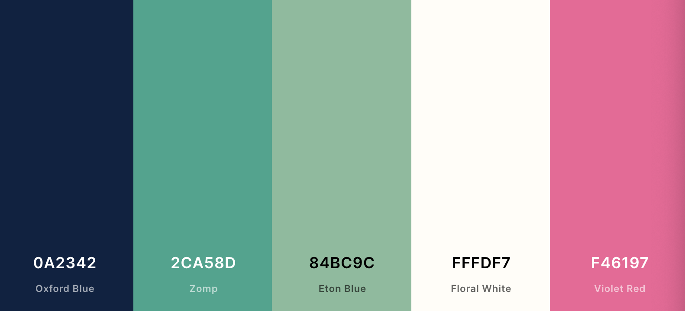

> Fork deze leertaak en ga aan de slag. Onderstaande outline ga je gedurende deze taak in jouw eigen GitHub omgeving uitwerken. De instructie vind je, zoals altijd, in: [docs/INSTRUCTIONS.md](docs/INSTRUCTIONS.md)
# Visitekaartje Voorbeeld Student

<!-- Add a link to your live demo in Github Pages 🌐-->
  
<!-- Add a nice poster image here at the end of the week, showing off your shiny frontend 📸 -->
[Bekijk visitekaartje](https://voorbeeldstudent.github.io/fdnd-net-presence-duplicate/)

## Ontwerpkeuzes
*Documenteer hier de ontwerpkeuzes die je hebt gemaakt*

Ik heb via [coolors.co](https://coolors.co/0a2342-2ca58d-84bc9c-fffdf7-f46197) een mooi kleurenpalet samengesteld.

Ik denk dat ik Oxford Blue en Zomp wil gebruiken voor de gradient. Floral white als tekstkleur en misschien een highlight in Violet Red. De achtergrond mag zakelijk, betrouwbaar en wat serieuzer overkomen, vandaar blauw en groen tinten. Het roze voor de highlights laat een speels, inventief karakter zien.

## Ontvangen Feedback
*Welke feedback heb je ontvangen en wat heb je ermee gedaan?*

