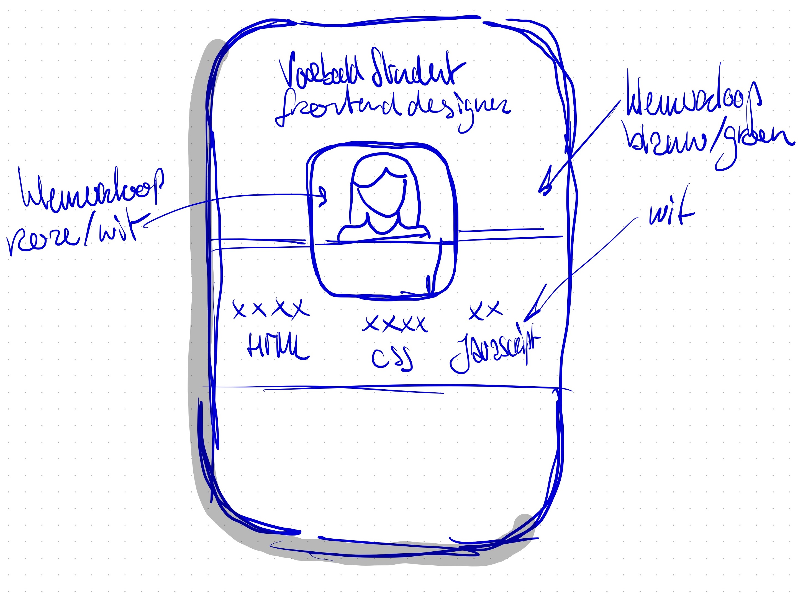

# Visitekaartje Voorbeeld Student

<!-- Add a link to your live demo in Github Pages 🌐-->
  
<!-- Add a nice poster image here at the end of the week, showing off your shiny frontend 📸 -->
[Bekijk visitekaartje](https://voorbeeldstudent.github.io/fdnd-net-presence-duplicate/)

## Ontwerpkeuzes
*Documenteer hier de ontwerpkeuzes die je hebt gemaakt*

Ik heb via [coolors.co](https://coolors.co/0a2342-2ca58d-84bc9c-fffdf7-f46197) een mooi kleurenpalet samengesteld.

Ik denk dat ik Oxford Blue en Zomp wil gebruiken voor de gradient. Floral white als tekstkleur en misschien een highlight in Violet Red. De achtergrond mag zakelijk, betrouwbaar en wat serieuzer overkomen, vandaar blauw en groen tinten. Het roze voor de highlights laat een speels, inventief karakter zien.

Als afbeelding wil ik mijn avatar gebruiken, ik vind het niet prettig foto's van mijzelf op internet te publiceren. Ik ga bij mijn avatar proberen om een achtergrond verloop van wit naar roze te maken.

Het lettertype laat ik staan, lettertypen zonder schreef zijn op internet prima te lezen.

Als titel kies ik voor *Frontend Designer* omdat ik die achtergrond in mijn MBO opleiding grafische vormgeving heb. Als motto kies ik voor: ```...```

Hieronder mijn schets:



## Ontvangen Feedback
*Welke feedback heb je ontvangen en wat heb je ermee gedaan?*


