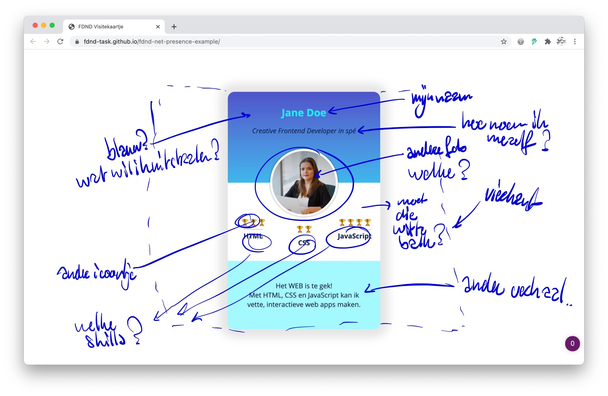

# Net Presence
Je maakt op basis van het voorbeeld een eigen visitekaartje. Dit doe je door de bestaande inhoud in HTML, de opmaak in CSS en de functionaliteit in Javascript aan te passen en naar je had te zetten.

## Context
Elke frontender bij [FNDN](https://fdnd.nl) stelt zichzelf binnen de tribe voor door middel van een visitekaartje. Als het goed is heb je al naar een voorbeeld van *Jane Doe* gekeken. Als je dat nog niet hebt gedaan is het handig [het voorbeeld](https://github.com/fdnd-task/fdnd-net-presence-example) even te bestuderen voor je verder gaat. Bij deze leertaak doorloop je alle stappen van de development-lifecycle met als resultaat een eigen visitekaartje, gepubliceerd via Github pages.

## Briefing
Maak een visitekaartje op basis van [het voorbeeld](https://github.com/fdnd-task/fdnd-net-presence-example) en publiceer dat via Github pages.

## Doel van deze opdracht
Na het volgen van deze opdracht heb je, voor het eerst bij [FNDN](https://fdnd.nl), zelf een visitekaartje gemaakt. Je hebt hiervoor een aantal eigen ontwerpbeslissingen gemaakt en HTML (voor de structuur), CSS (voor de vormgeving) en Javascript (voor de interactie) gebruikt om het ontwerp te implementeren. Tot slot heb je jouw visitekaartje gepubliceerd via GitHub pages en met een aantal klasgenoten getest of het werkt zoals je bedoelde.

## Materiaal
Hieronder vind je een aantal bronnen die je kunt gebruiken bij het maken van ontwerpbeslissingen en het implementeren van jouw ontwerp.

### Kleur en beeld
- [The psychology of color in web design @ 99designs](https://en.99designs.nl/blog/creative-inspiration/psychology-color-web-design/)
- [Web design color theory @ TNW](https://thenextweb.com/dd/2015/04/07/how-to-create-the-right-emotions-with-color-in-web-design/)
- [How to use images more effectively in web design @ CreativeBloq](https://www.creativebloq.com/inspiration/how-to-use-images-more-effectively-in-web-design)
- [Unsplash](https://unsplash.com/)
- [Icons in web design @ Medium](https://medium.com/outcrowd/icons-in-web-design-824f57cb2db0)

### HyperText Markup Language (HTML)
- [HTML semantics @ YouTube](https://www.youtube.com/watch?v=n9T2B91hHRM)
- [Overzicht van HTML elementen @ MDN](https://developer.mozilla.org/nl/docs/Web/HTML/Element)

### Cascading StyleSheets (CSS)
- [CSS Almanac @ CSS-tricks](https://css-tricks.com/almanac/)
- [A Guide to flexbox @ CSS-tricks](https://css-tricks.com/snippets/css/a-guide-to-flexbox/)
- [What the flexbox? @ Wes Bos](https://flexbox.io/)
- [CSS Typography - Change Font, Size, Spacing & more @ YouTube](https://www.youtube.com/watch?v=RNakAX3rVVw)
- [Typography for Developers @ CSS-tricks](https://css-tricks.com/typography-for-developers/)
- [CSS Transitions and Animations 101 @ YouTube](https://www.youtube.com/watch?v=n9T2B91hHRM)

### Javascript
- [One thing about JavaScript @ CSS-tricks](https://css-tricks.com/video-screencasts/150-hey-designers-know-one-thing-javascript-recommend/)

### Tools
- [Chrome Dev Tools Elements Tab @ YouTube](https://www.youtube.com/watch?v=Z3HGJsNLQ1E)
- [Creating a Github pages site @ Github](https://docs.github.com/en/github/working-with-github-pages/creating-a-github-pages-site#creating-your-site)
- [How To Publish Your HTML With Github Pages @ Github](https://anilemrah.medium.com/how-to-publish-your-html-with-github-pages-8f3f854e7d4)

## Werkwijze
Volg onderstaand stappenplan binnen de development-lifecycle om jouw visitekaartje gestructureerd te herontwerpen, aan te passen en op Github te publiceren.

### Analyseren
Je hebt een talk bijgewoond en/of bovenstaande artikelen over [kleur en beeld](#kleur-en-beeld) gelezen. Om straks op een goede manier te werk te kunnen gaan is het handig om eerst te inventariseren welke uitgangspunten je wilt gebruiken voor het ontwerpen en ontwikkelen van jouw eigen visitekaartje. 

Begin met het vastleggen van de kleur(en) die je wilt gaan gebruiken. Beschrijf daarbij waarom juist die kleur(en). Wat wil je uitstralen? Met welk gevoel bekijken mensen jouw online visitekaartje?

Bepaal nu of je een afbeelding op jouw visitekaartje wilt opnemen. Wordt het een échte foto of een avatar? Of een foto waarin je iets minder herkenbaar in beeld komt? Welk beeld moeten bezoekers van jou hebben na het bekijken van jouw online visitekaartje?

Bepaal welk(e) lettertype(n) je wilt gebruiken. Er staat hier boven een goede bron die je kunt gebruiken bij [Cascading StyleSheets (CSS)](#cascading-styleSheets) Maak een lijstje met vijf lettertypes die je mooi vindt, kies deze via [https://fonts.google.com/](https://fonts.google.com/).  Je weet nog niet hoe het lettertype combineert met jouw afbeelding en de kleuren dus het is fijn als je een paar opties hebt.

Bepaal tenslotte een titel en een korte introductietekst voor je visitekaartje. Na bovenstaande stappen zorgvuldig doorlopen te hebben ga je verder naar de volgende fase. 

### Ontwerpen

### Bouwen

### Integreren

### Testen

## Criteria
Definitions of done

