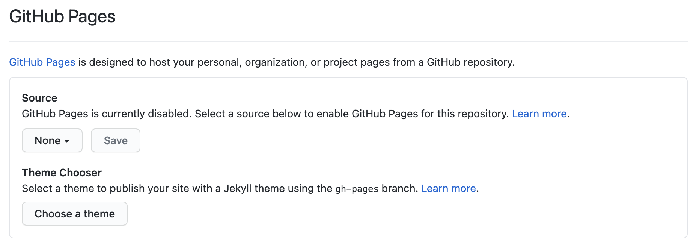
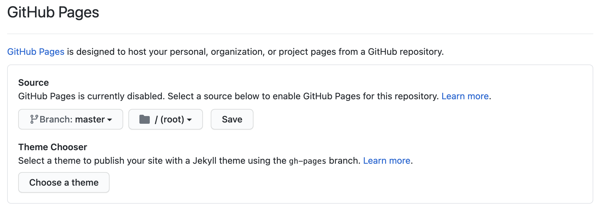

# Net Presence
Je maakt op basis van het voorbeeld een eigen visitekaartje. Dit doe je door de bestaande inhoud in HTML, de opmaak in CSS en/of de functionaliteit in Javascript aan te passen en naar je hand te zetten.

## Context
Elke frontender bij [FNDN](https://fdnd.nl) stelt zichzelf binnen de tribe voor door middel van een visitekaartje. Als het goed is heb je al naar een voorbeeld van *Jane Doe* gekeken. Als je dat nog niet hebt gedaan is het handig [het voorbeeld](https://github.com/fdnd-task/fdnd-net-presence-example) even te bestuderen voor je verder gaat. Bij deze leertaak doorloop je alle stappen van de development-lifecycle met als resultaat een eigen visitekaartje, gepubliceerd via Github pages.

## Briefing
Maak een visitekaartje op basis van [het voorbeeld](https://github.com/fdnd-task/fdnd-net-presence-example) en publiceer dat via Github pages.

## Doel van deze opdracht
Na het volgen van deze opdracht heb je, voor het eerst bij [FNDN](https://fdnd.nl), zelf een visitekaartje gemaakt. Je hebt hiervoor een aantal eigen ontwerpbeslissingen gemaakt en HTML (voor de structuur), CSS (voor de vormgeving) en Javascript (voor de interactie) gebruikt om het ontwerp te implementeren. Tot slot heb je jouw visitekaartje gepubliceerd via GitHub pages en met een aantal klasgenoten getest of het werkt zoals je bedoelde.


## Materiaal
Hieronder vind je een aantal bronnen die je kunt gebruiken bij het maken van ontwerpbeslissingen en het implementeren van jouw ontwerp.

### Kleur en beeld
- [The psychology of color in web design @ 99designs](https://en.99designs.nl/blog/creative-inspiration/psychology-color-web-design/)
- [Web design color theory @ TNW](https://thenextweb.com/dd/2015/04/07/how-to-create-the-right-emotions-with-color-in-web-design/)
- [How to use images more effectively in web design @ CreativeBloq](https://www.creativebloq.com/inspiration/how-to-use-images-more-effectively-in-web-design)
- [Unsplash](https://unsplash.com/)
- [Typography for Developers @ CSS-tricks](https://css-tricks.com/typography-for-developers/)
- [Icons in web design @ Medium](https://medium.com/outcrowd/icons-in-web-design-824f57cb2db0)

### HyperText Markup Language (HTML)
- [HTML semantics @ YouTube](https://www.youtube.com/watch?v=n9T2B91hHRM)
- [Overzicht van HTML elementen @ MDN](https://developer.mozilla.org/nl/docs/Web/HTML/Element)

### Cascading StyleSheets (CSS)
- [CSS Almanac @ CSS-tricks](https://css-tricks.com/almanac/)
- [A Guide to flexbox @ CSS-tricks](https://css-tricks.com/snippets/css/a-guide-to-flexbox/)
- [What the flexbox? @ Wes Bos](https://flexbox.io/)
- [CSS Typography - Change Font, Size, Spacing & more @ YouTube](https://www.youtube.com/watch?v=RNakAX3rVVw)
- [CSS Transitions and Animations 101 @ YouTube](https://www.youtube.com/watch?v=n9T2B91hHRM)

### Javascript
- [One thing about JavaScript @ CSS-tricks](https://css-tricks.com/video-screencasts/150-hey-designers-know-one-thing-javascript-recommend/)

### Tools
- [Chrome Dev Tools Elements Tab @ YouTube](https://www.youtube.com/watch?v=Z3HGJsNLQ1E)
- [Creating a Github pages site @ Github](https://docs.github.com/en/github/working-with-github-pages/creating-a-github-pages-site#creating-your-site)
- [How To Publish Your HTML With Github Pages @ Github](https://anilemrah.medium.com/how-to-publish-your-html-with-github-pages-8f3f854e7d4)
- [https://coolors.co/](https://coolors.co/)

## Werkwijze
Volg onderstaand stappenplan binnen de development-lifecycle om jouw visitekaartje gestructureerd te herontwerpen, aan te passen en op Github te publiceren.

### Analyseren
*In de analysefase inventariseer je wat er moet gebeuren om een taak uit te voeren.* 

Voor het uitvoeren van deze taak nemen we een aantal stappen, we gaan:
1. een aantal ontwerpbeslissingen nemen op basis van de uitleg
2. die beslissingen inbouwen in het bestaande visitekaartje
3. jouw visitekaartje publiceren via Github pages
4. het visitekaartje testen op klasgenoten
5. het proces documenteren in de [README.md](../README.md)

### Ontwerpen
*In de ontwerpfase neem je ontwerpbeslissingen en zorg je dat je precies weet wat je moet gaan bouwen.*

Je hebt een talk bijgewoond en/of bovenstaande artikelen over [kleur en beeld](#kleur-en-beeld) gelezen. Om straks op een goede manier te werk te kunnen gaan is het handig om eerst te inventariseren welke uitgangspunten je wilt gebruiken voor het ontwerpen en ontwikkelen van jouw eigen visitekaartje. 

Begin met het vastleggen van de kleur(en) die je wilt gaan gebruiken. Beschrijf daarbij waarom juist die kleur(en). Wat wil je uitstralen? Met welk gevoel bekijken mensen jouw online visitekaartje? Leg een kleurenschema vast via [https://coolors.co/](https://coolors.co/)

Bepaal nu of je een afbeelding op jouw visitekaartje wilt opnemen. Wordt het een échte foto of een avatar? Of een foto waarin je iets minder herkenbaar in beeld komt? Welk beeld moeten bezoekers van jou hebben na het bekijken van jouw online visitekaartje?

Bepaal welk(e) lettertype(n) je wilt gebruiken. Maak een lijstje met vijf lettertypes die je mooi vindt, kies deze via [https://fonts.google.com/](https://fonts.google.com/).  Je weet nog niet hoe het lettertype combineert met jouw afbeelding en de kleuren dus het is fijn als je een paar opties hebt.

Bepaal tenslotte een titel en een korte introductietekst voor je visitekaartje. De titel is de rol die je jezelf toebedeelt op internet, het kan serieus maar ook grappig zijn. Bedenk hoe je wilt overkomen op bezoekers van jouw visitekaartje. De introductietekst bevat een kort motto. Wat vind jij belangrijk?


Normaliter neem je bovenstaande ontwerpbeslissingen en ontwerp je het visitekaartje in een tool als [https://www.figma.com/](https://www.figma.com/). Omdat we een *duplicate* taak uitvoeren houden we het bij een schets: schets met potlood, fineliner en een shader het visitekaartje. Je kunt het kant-en-klare visitekaartje van de *example* leertaak gebruiken. Schets het visitekaartje na en noteer jouw ontwerpbeslissingen.

Na bovenstaande stappen zorgvuldig doorlopen te hebben weet je precies wat je gaat bouwen. Je kunt nu goed voorbereid door naar de volgende fase.

### Bouwen
*In de bouwfase realiseer je de beslissingen uit de ontwerpfase.*

#### HTML
Alle inhoud van een webpagina wordt vastgelegd in HTML. Neem de tijd voor deze stap en zorg dat je het HTML bestand begrijpt.

Open het ```/index.html``` bestand in een editor.

Op regel 13 staat een ```<h1>...</h1>``` element met de naam *Jane Doe*. Voer hier jouw eigen naam in.

Op regel 14 staan ```<p><em>...</em></p>``` elementen met daarin de *titel* van Jane. Pas dit aan naar jouw eigen titel.

Pas op dezelfde manier de vaardigheden op regels 38 en verder en het motto op regel 43 aan. 

NB: Je kunt als je wilt ook de icoontjes vervangen voor iets wat beter bij jouw past, gebruik daarvoor de [Unicode Character Table](https://unicode-table.com/en/).

#### CSS
Alle kleuren in een webpagina (achtergrond, tekst, randen, schaduwen etc) worden vastgelegd in CSS. Neem de tijd voor deze stap en zorg dat je het CSS bestand begrijpt. 

Open het ```/styles/style.css``` bestand in een editor. 

Op regel 24 en 25 wordt de achtergrondkleur vastgelegd in de regels:
```
background: rgb(0,239,255);
background: linear-gradient(0deg, rgba(0,239,255,1) 40%, #4e54c8 100%);
```
De eerste waarde stelt een kleur in met RGB notatie. Eerder heb je in [coolors.co](https://coolors.co/) kleuren uitgekozen. Voer de RGB waarde voor jouw achtergrondkleur in. Als je het interessant vindt mag je proberen de gradient naar je hand te zetten ;)

Op regel 13 staat ```color: #10214e```, deze regel legt de normale tekstkleur van het bestand vast in hexadecimale notatie. Pas ook deze kleur aan naar jouw kleurenpalet.

Zoek het bestand verder door en zet alle ```background``` en ```color``` declaraties naar jouw hand.

NB: In het bestand wordt ook de stijl bepaald van twee SVG afbeeldingen. De declaraties die hier voor gebruikt worden zijn ```stroke``` en ```fill```. Als je het tof vindt kan je ook die kleuren aanpassen aan jouw kleurenpalet!

### Integreren
*In de integratiefase voer je de aanpassingen door zodat iedereen ze kan zien.*

Je gaat jouw aanpassing op het visitekaartje publiceren op internet! Dat klinkt lastig maar is heel eenvoudig met Github pages (gh-pages).

Bovenin het scherm van Github zie je *Code*, *Issues*, *Pull requests*, *Actions* etc.. Helemaal aan het eind staat *Settings*, klik op Settings om naar de instellingen van deze repository te gaan. (Het kan zijn dat je op de ... moet klikken voor je settings ziet)

Scroll helemaal naar beneden, vlak boven *Danger Zone* staat het kopje **Github Pages** en dat is precies waar wij naar op zoek zijn. Als het goed is zie je hetzelfde als in onderstaande screenshot:



Selecteer bij *Source* de **Master** branch in plaats van *None*  en klik op Save:



Als het goed is gegaan kan je binnen enkele momenten jouw visitekaartje bekijken via de URL: [https://username.github.io/fdnd-net-presence-duplicate/](https://username.github.io/fdnd-net-presence-duplicate/).

Bekijk jouw visitekaartje even uitgebreid, ga daarna verder met de volgende fase.

### Testen
*In de testfase controleer je of jouw aanpassingen werken zoals bedoeld.*

Laat jouw visitekaartje testen door een paar klasgenoten en jouw docent. Noteer wat ze er van vinden. Ben je tevreden met het resultaat? Zo niet herhaal dan bovenstaande stappen.

## Criteria
Je bent klaar als je jouw proces (ontwerpbeslissingen, schetsen, inzichten en testresultaten) hebt gedocumenteerd in de [README.md](../README.md) in jouw *fork* van deze repository. Ook moet jouw visitekaartje bereikbaar zijn via gh-pages.


